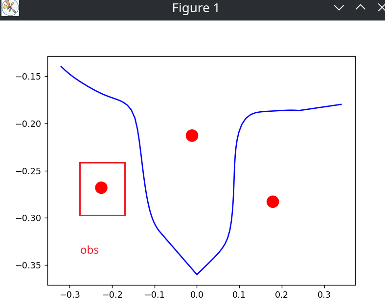

# arm_avoid_obs

这个项目是一个结合目标检测，深度相机，避障算法的一个简易机械臂避障demo

仿真环境：[使用了瑞尔曼的机械臂项目仿真环境](https://github.com/LYouC/ros2_rm_robot.git)
参考项目：[机械臂避障](https://github.com/yias/robot_arm_motion.git)

## 项目启动

系统环境：Ubuntu 22.04 + ROS2 Humble
python版本：3.10

项目克隆

``` bash
git clone https://github.com/LYouC/arm_avoid_obs.git # 克隆主仓库
cd arm_avoid_obs
git submodule update --init --recursive         # 克隆子模块
```

安装依赖

``` bash
cd arm_avoid_obs
rosdep install --from-paths src --ignore-src -r -y
pip install onnxruntime onnx pycocotools
```

编译

```bash
colcon build --symlink-install
```

修改模型路径，因为gazebo的模型文件使用绝对路径，这样不太方便。所以这里通过xacro换成了包路径，在使用前需要先进行转换

```bash
source install/setup.bash
xacro src/obs_avoid/models/gazebo_world.xacro.xml -o src/obs_avoid/models/gazebo_world.xml
```

启动

> 启动仿真环境后如果发现太暗了，请点击左上方的场景面板，选择scene，然后去掉阴影选项

```bash
source install/setup.bash
ros2 launch obs_avoid start_gazebo.launch.py    # 启动仿真环境
ros2 launch obs_avoid start_node.launch.py      # 启动避障规划节点
```

指定目标点(这个目标点是测试过效果较好的)（每6个代表一个点，x,y,z,roll,pitch,yaw）

```bash
ros2 topic pub /move_target std_msgs/msg/Float32MultiArray "layout:
  dim: []
  data_offset: 0
data: [-0.32, -0.14, 0.23, 3.14, 0, 0, 0.0,-0.36,0.23,3.14,0,0, 0.34, -0.18, 0.23, 3.14, 0.0, 0.0]" 
```

在图表中查看轨迹

```bash
source install/setup.bash
ros2 run obs_avoid show_traj.py 
```



---

## 目录说明

> 代码文件都仿真在src下，其中rm_robot是瑞尔曼的机械臂项目，obs_avoid是本项目的主要代码

obs_avoid:

* launch: 启动文件，主要是启动gazebo和避障规划节点
* obs_avoid: 该功能包同时使用了python与cpp，这个文件夹是python代码，主要是物体检测的代码,还有一些小工具
* include: 头文件,避障规划的代码都在这里
* models: 模型文件
* config: 配置文件
